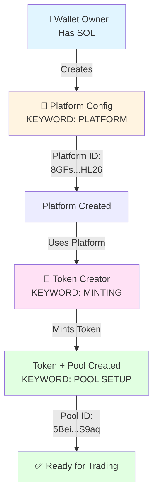
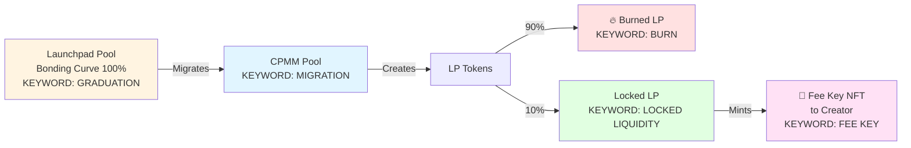

# Raydium Launchpad Ecosystem - Visual Guide

**Purpose**: Comprehensive visual representation of all roles, flows, and benefits in the Raydium launchpad ecosystem.

---

## 🎭 Ecosystem Roles

### Role 1: Wallet Owner 👤
**Action**: Holds SOL, creates platform and tokens
**Requirements**:
- Solana wallet
- Devnet SOL (~5 SOL for testing)

**Keywords**: `FUNDING`, `OWNERSHIP`, `AUTHORITY`

---

### Role 2: Platform Creator 🏢
**Action**: Creates platform configuration
**Responsibility**: Defines fee structure and governance
**Benefits**:
- ✅ Receives 80% of all trading fees (largest share)
- ✅ Controls platform parameters
- ✅ Can claim fees from all tokens on their platform

**Keywords**: `PLATFORM CONFIG`, `FEE STRUCTURE`, `GOVERNANCE`

**In Your Case**: YOU are the platform creator

---

### Role 3: Token Creator 🎨
**Action**: Creates token and launchpad pool
**Responsibility**: Launches and manages token lifecycle
**Benefits**:
- ✅ Receives 15% of trading fees (during launchpad phase)
- ✅ Can enable Fee Key NFT for perpetual post-migration fees
- ✅ Controls token supply and parameters
- ✅ Can share fees with partners

**Keywords**: `MINTING`, `TOKEN CREATION`, `POOL SETUP`, `CREATOR FEES`

**In Your Case**: YOU are also the token creator (same wallet as platform)

---

### Role 4: Trader 💸
**Action**: Buys and sells tokens
**Responsibility**: Provides liquidity through trading
**Benefits**:
- ✅ Early access to tokens via bonding curve
- ✅ Price discovery through automated market maker
- ✅ Can participate in Burn & Earn (5% fees)

**Cost**: Pays 1% trading fee on each transaction

**Keywords**: `TRADING`, `BUYING`, `SELLING`, `FEE GENERATION`

---

### Role 5: Fee Share Receiver 🤝
**Action**: Receives shared portion of creator fees
**Responsibility**: Partnership/referral relationship with creator
**Benefits**:
- ✅ Receives up to 100% of creator's fee share (configurable)
- ✅ No upfront investment required

**Keywords**: `PARTNERSHIP`, `REVENUE SHARING`, `REFERRAL`

**Example**: If creator sets 50% share rate:
- Creator: 7.5% (half of 15%)
- Partner: 7.5% (half of 15%)

---

### Role 6: Fee Key NFT Holder 🔑
**Action**: Holds NFT after token graduation
**Responsibility**: Maintains ownership of Fee Key NFT
**Benefits**:
- ✅ Receives 10% of ALL LP trading fees (perpetual)
- ✅ Passive income as long as trading continues
- ✅ Can transfer/sell the NFT (transfers claim rights)

**Keywords**: `POST-GRADUATION`, `PERPETUAL FEES`, `NFT OWNERSHIP`

**Usually**: Same person as token creator (NFT minted to creator on graduation)

---

### Role 7: Liquidity Provider (LP) 💧
**Action**: Provides liquidity to CPMM pool (post-graduation)
**Responsibility**: Maintains liquidity for trading
**Benefits**:
- ✅ Receives 90% of LP trading fees
- ✅ Can earn yield on deposited assets

**Keywords**: `LIQUIDITY`, `CPMM POOL`, `LP TOKENS`

**Note**: After migration, 90% of LP tokens are burned, 10% locked

---

## 📊 Setup Flow (What We Did)



**Keywords in Flow**:
- `WALLET SETUP` → Wallet Owner configures keypair
- `PLATFORM CREATION` → Platform config with fee structure (80/15/5)
- `TOKEN MINTING` → Creating token on launchpad
- `POOL INITIALIZATION` → Bonding curve pool ready
- `TRADING ENABLED` → Users can buy/sell

---

## 💰 Fee Distribution Flow (Launchpad Phase)

### Phase 1: Before Token Graduation

```
┌─────────────────────────────────────────────┐
│          💸 TRADER MAKES TRADE              │
│         (e.g., Buy 10 tokens)               │
│                                             │
│         Cost: 1 SOL + 1% fee (0.01 SOL)    │
│         KEYWORD: TRADING, FEE GENERATION    │
└──────────────────┬──────────────────────────┘
                   │
                   ▼
        ┌──────────────────────┐
        │  Total Fee: 0.01 SOL │
        │  KEYWORD: FEE SPLIT  │
        └──────────┬───────────┘
                   │
        ┌──────────┴──────────┐
        │                     │
        ▼                     ▼
┌──────────────┐    ┌──────────────────┐
│ Platform Fee │    │  Creator Portion │
│   0.008 SOL  │    │    0.0015 SOL    │
│   (80%)      │    │     (15%)        │
│              │    │                  │
│ KEYWORD:     │    │ KEYWORD:         │
│ PLATFORM     │    │ CREATOR FEES     │
│ REVENUE      │    │ CLAIMABLE        │
└──────────────┘    └────┬─────────────┘
                         │
              ┌──────────┴──────────┐
              │                     │
              ▼                     ▼
     ┌────────────────┐   ┌─────────────────┐
     │ Token Creator  │   │ Share Receiver  │
     │   0.00075 SOL  │   │   0.00075 SOL   │
     │   (50%)        │   │   (50%)         │
     │                │   │                 │
     │ KEYWORD:       │   │ KEYWORD:        │
     │ CLAIM          │   │ FEE SHARING     │
     │ claimCreator   │   │ PARTNERSHIP     │
     │ Fee()          │   │                 │
     └────────────────┘   └─────────────────┘

┌──────────────────┐
│   Burn & Earn    │
│    0.0005 SOL    │
│      (5%)        │
│                  │
│ KEYWORD: BURN    │
└──────────────────┘
```

**Key Actions**:
- 🏢 **Platform Creator**: Calls `claimPlatformFee()` → Gets 0.008 SOL
- 🎨 **Token Creator**: Calls `claimCreatorFee()` → Gets 0.00075 SOL
- 🤝 **Share Receiver**: Automatically receives → Gets 0.00075 SOL
- 🔥 **Burn Program**: Automatic → Gets 0.0005 SOL

---

## 🎓 Token Graduation & Migration

### When Token Completes Bonding Curve



**What Happens**:
1. **Bonding curve completes** (reaches 100% or fundraising goal)
2. **Liquidity migrates** from launchpad → CPMM pool
3. **LP tokens generated** from the migrated liquidity
4. **90% of LP burned** (destroyed forever)
5. **10% of LP locked** in Burn & Earn program
6. **Fee Key NFT minted** to token creator wallet

**Keywords**: `GRADUATION`, `MIGRATION`, `LP GENERATION`, `FEE KEY MINTING`

---

## 🔑 Post-Migration Fee Flow (CPMM Phase)

### Phase 2: After Token Graduates

```
┌─────────────────────────────────────────────┐
│       💸 TRADER MAKES TRADE ON CPMM         │
│            (Post-graduation)                │
│                                             │
│      KEYWORD: CPMM TRADING, LP FEES         │
└──────────────────┬─────────────────────────┘
                   │
                   ▼
        ┌──────────────────────┐
        │   LP Trading Fees    │
        │   KEYWORD: LP FEES   │
        └──────────┬───────────┘
                   │
        ┌──────────┴──────────┐
        │                     │
        ▼                     ▼
┌──────────────────┐   ┌──────────────────┐
│  90% → LPs       │   │ 10% → Fee Key NFT│
│  (Liquidity      │   │     Holder       │
│   Providers)     │   │                  │
│                  │   │  KEYWORD:        │
│  KEYWORD:        │   │  PERPETUAL FEES  │
│  LP REWARDS      │   │  NFT CLAIM       │
└──────────────────┘   └──────────────────┘
                              │
                              ▼
                    ┌──────────────────┐
                    │  Token Creator   │
                    │  (Usually)       │
                    │                  │
                    │  Calls:          │
                    │  harvestLock     │
                    │  Position()      │
                    │                  │
                    │  KEYWORD:        │
                    │  CLAIM PERPETUAL │
                    └──────────────────┘
```

**Key Difference**:
- ❌ No more platform/creator/burn split
- ✅ Fee Key NFT holder gets 10% of ALL LP fees
- ✅ This continues FOREVER (as long as trading happens)

---

## 📈 Complete Timeline

```
TIME →

Phase 1: SETUP
├─ Wallet Setup (KEYWORD: WALLET)
├─ Platform Creation (KEYWORD: PLATFORM CONFIG)
├─ Token Minting (KEYWORD: MINTING)
└─ Pool Initialization (KEYWORD: POOL SETUP)
    │
    ▼
Phase 2: LAUNCHPAD TRADING (Pre-Graduation)
├─ Users Buy/Sell (KEYWORD: TRADING)
├─ Fees Accumulate (KEYWORD: FEE GENERATION)
├─ Platform Claims 80% (KEYWORD: PLATFORM FEES)
├─ Creator Claims 15% (KEYWORD: CREATOR FEES)
├─ Share Receiver Gets % (KEYWORD: FEE SHARING)
└─ Burn Program Gets 5% (KEYWORD: BURN)
    │
    ▼
Phase 3: GRADUATION
├─ Bonding Curve Completes (KEYWORD: GRADUATION)
├─ Migration to CPMM (KEYWORD: MIGRATION)
├─ LP Tokens Generated (KEYWORD: LP)
├─ 90% LP Burned (KEYWORD: BURN)
├─ 10% LP Locked (KEYWORD: LOCKED LIQUIDITY)
└─ Fee Key NFT Minted (KEYWORD: FEE KEY NFT)
    │
    ▼
Phase 4: CPMM TRADING (Post-Graduation)
├─ Users Trade on CPMM (KEYWORD: CPMM TRADING)
├─ LP Fees Generated (KEYWORD: LP FEES)
├─ 90% → LPs (KEYWORD: LP REWARDS)
└─ 10% → Fee Key NFT Holder (KEYWORD: PERPETUAL FEES)
    │
    ▼
Phase 5: ONGOING (Forever)
└─ Continuous passive income via Fee Key NFT 🔑
```

---

## 🎯 Benefits Matrix

### Who Gets What & When

| Role | Launchpad Phase | Post-Migration | How to Claim | Keywords |
|------|----------------|----------------|--------------|----------|
| **Platform Creator** | ✅ 80% of fees | ❌ No direct fees | `claimPlatformFee()` | PLATFORM REVENUE |
| **Token Creator** | ✅ 15% of fees | ❌ No direct fees<br/>✅ NFT minted | `claimCreatorFee()` | CREATOR FEES, CLAIMING |
| **Share Receiver** | ✅ 0-100% of creator's share | ❌ No | Automatic | FEE SHARING, PARTNERSHIP |
| **Traders** | ❌ Pays 1% fee | ❌ Pays LP fees | N/A | TRADING, BUYING, SELLING |
| **Fee Key NFT Holder** | ❌ Doesn't exist yet | ✅ 10% of LP fees | `harvestLockPosition()` | PERPETUAL FEES, NFT |
| **Liquidity Providers** | ❌ No LP yet | ✅ 90% of LP fees | Standard LP claim | LP REWARDS, LIQUIDITY |
| **Burn & Earn** | ✅ 5% of fees | ✅ Locked LP | Burn program | BURN, TOKENOMICS |

---

## 🔄 Your Specific Case

### Dual Role: Platform + Token Creator

```
You (DJqE...27aY)
├─ 🏢 Platform Creator
│   └─ Receives 80% of trading fees
│       └─ Platform ID: 8GFs...HL26
│
└─ 🎨 Token Creator
    ├─ Receives 15% of trading fees
    │   └─ Pool ID: 5Bei...S9aq
    │   └─ Mint A: Bnv1...BmbE
    │
    └─ 🔑 Future Fee Key NFT Holder (after graduation)
        └─ Will receive 10% of perpetual LP fees
```

**Your Total Benefits**:
- Launchpad Phase: **95%** of all fees (80% + 15%)
- Post-Migration: **10%** of LP fees (via Fee Key NFT)

**Why 95% not 100%**: 5% goes to Burn & Earn program

---

## 💡 Key Concepts & Keywords

### Setup Keywords
- **WALLET**: Your Solana wallet with keypair
- **PLATFORM CONFIG**: Fee structure and governance rules
- **MINTING**: Creating a new token
- **POOL SETUP**: Initializing bonding curve pool

### Trading Keywords
- **TRADING**: Buy/sell actions by users
- **FEE GENERATION**: Fees collected from each trade
- **BONDING CURVE**: Automated pricing mechanism

### Fee Keywords
- **PLATFORM FEES**: 80% share to platform creator
- **CREATOR FEES**: 15% share to token creator
- **FEE SHARING**: Splitting creator fees with partners
- **BURN**: 5% share to burn program
- **CLAIMING**: Action to retrieve accumulated fees

### Migration Keywords
- **GRADUATION**: Bonding curve completion
- **MIGRATION**: Moving liquidity to CPMM
- **LP TOKENS**: Liquidity provider tokens
- **LOCKED LIQUIDITY**: 10% of LP locked for NFT
- **FEE KEY NFT**: NFT granting perpetual fee rights

### Post-Migration Keywords
- **CPMM TRADING**: Trading on constant product pool
- **LP FEES**: Fees from CPMM trading
- **PERPETUAL FEES**: Ongoing fee income via NFT
- **LP REWARDS**: 90% of fees to liquidity providers

---

## 🎓 Learning Checklist

Track your understanding:

### Setup Phase
- [ ] I understand what a wallet owner does
- [ ] I know why we create a platform config first
- [ ] I understand the 80/15/5 fee split
- [ ] I can explain what minting means
- [ ] I know the difference between Platform ID and Pool ID

### Launchpad Phase
- [ ] I understand how traders generate fees
- [ ] I know how to claim platform fees
- [ ] I know how to claim creator fees
- [ ] I understand fee sharing with partners
- [ ] I can check accumulated fees before claiming

### Migration Phase
- [ ] I understand when graduation happens
- [ ] I know what happens to liquidity during migration
- [ ] I understand LP token distribution (90% burn, 10% lock)
- [ ] I know what the Fee Key NFT represents
- [ ] I understand who receives the Fee Key NFT

### Post-Migration Phase
- [ ] I understand CPMM trading
- [ ] I know how LP fees are distributed
- [ ] I understand the 10% perpetual fee benefit
- [ ] I know how to claim fees using Fee Key NFT
- [ ] I understand the long-term value of the NFT

---

## 🔗 Quick Navigation

- **Setup Guide**: `SETUP_INSTRUCTIONS.md` - Step-by-step setup
- **Creator Fees**: `CREATOR_FEE_REFERENCE.md` - Launchpad phase fees
- **Fee Key NFT**: `FEE_KEY_NFT_GUIDE.md` - Post-migration fees
- **Learning Path**: `LEARNING_GUIDE.md` - Structured learning
- **Devnet Guide**: `README_DEVNET.md` - Devnet features

---

## 📝 Summary

**7 Main Roles**:
1. Wallet Owner 👤
2. Platform Creator 🏢 (YOU)
3. Token Creator 🎨 (YOU)
4. Trader 💸
5. Fee Share Receiver 🤝
6. Fee Key NFT Holder 🔑 (YOU after graduation)
7. Liquidity Provider 💧

**2 Fee Phases**:
1. **Launchpad**: Platform (80%) + Creator (15%) + Burn (5%)
2. **Post-Migration**: Fee Key NFT (10%) + LPs (90%)

**Your Benefits**:
- During Launchpad: **95% of fees** (80% + 15%)
- After Migration: **10% of LP fees** (perpetual via NFT)

🎉 **You have the most lucrative position in the ecosystem!**
